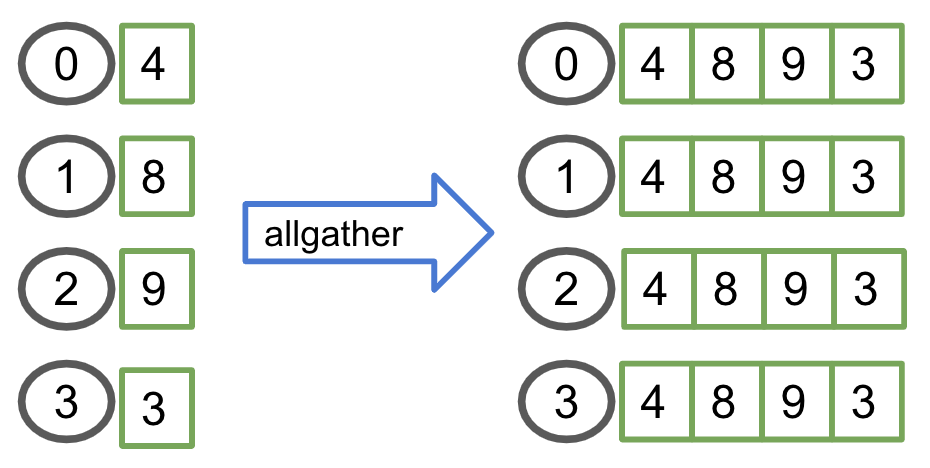
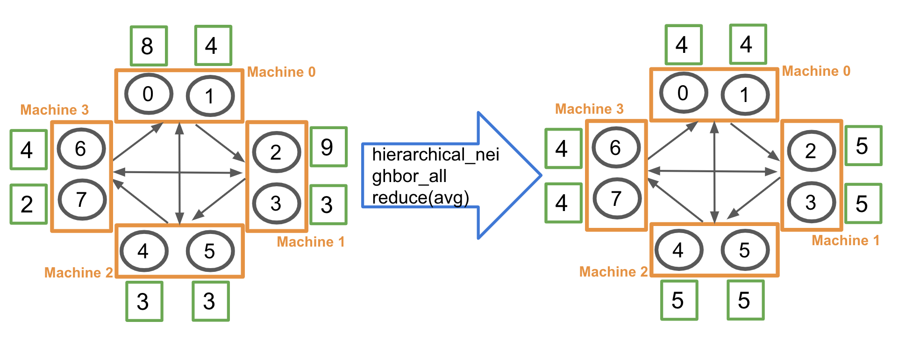
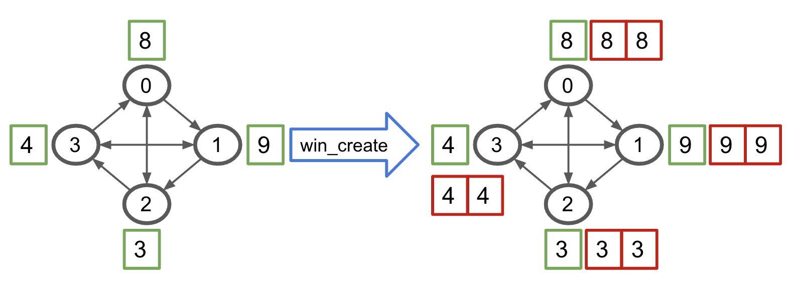
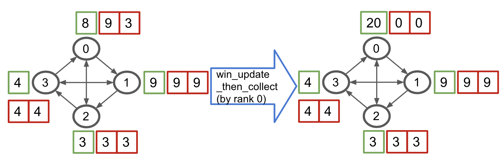

.. _Ops Explanation:

Bluefog Operations Explanation
==============================

The implementation of bluefog operations is built upon the MPI APIs. 
The naming of communication operations are all derived from MPI. However,
our usage and definition are slightly different from the MPI since the focus of bluefog ops
are highly associated with the virtual topology of network.

The communication ops that bluefog supported can be catogorized into three types:

1. Collective Ops: ``broadcast``, ``allreduce``, ``allgather``.
2. Neighbor Collective Ops: ``neighbor_allreduce``, ``neighbor_allgather``.
3. Hierarchical Collective Ops:  ``hierarchical_local_allreduce``, ``hierarchical_neighbor_allreduce``.
4. One-sided Communication Ops: ``win_create``, ``win_free``, ``win_put``, ``win_get``, ``win_accumulate``, ``win_update``, ``win_update_then_collect``.

We use figure to illustrate all those ops with 
similar style as in `MPI tutorials blog`_. 
In the figure, we use *circle* to represent one process, which is exchangeablely called node,
agent, host, etc. under some circumstance, and use green and red *square* to represent the data or tensor while
orange *square* for one machine. 
The number inside of circle is the rank of that process and th number inside of square is the value of data.
If you need more background information about MPI, we recommend this nice `tutorial`_.

Collective Ops
--------------
These three ``broadcast``, ``allreduce``, ``allgather`` ops are most basic collective MPI ops.
The bluefog implementation is almost exactly the same as the MPI definition. One small difference
is allreduce only support average and summation since bluefog focused on the numerical calculation only.

allgather
#########

allreduce
#########

.. image:: _static/bf_allreduce.png
    :alt: BluefogAllreduceExplanation
    :width: 300

broadcast
#########

.. image:: _static/bf_broadcast.png
    :alt: BluefogBroadcastExplanation
    :width: 450

Neighbor Colletive Ops
----------------------
Similar to their collective ops cousins, the behavior of neighbor collective ops is very similar,
except that their behavior is determined by the virtual topology as well. Loosenly speaking, 
allreduce and allgather are the same as running the neighbor_allreduce and neighbor_allgather 
over fully connected network. In the figure, we use the arrowed line to represent the connection of
virtual topology (notice it is the directed graph.)

neighbor_allgather
##################
.. image:: _static/bf_neighbor_allgather.png
    :alt: BluefogNeighborAllgatherExplanation
    :width: 600

neighbor_allreduce
##################
.. image:: _static/bf_neighbor_allreduce.png
    :alt: BluefogNeighborAllreduceExplanation
    :width: 600

.. Note::
   In the figure, we only show the neighbor_allreduce with average with uniform weight. Actually, our
   API allows for any weights for incoming edges. Check out API doc to see how to use it.

Hierarchical Collective Ops
---------------------------
In practice, the communication speed and behavior is different between intra-machine and inter-machine communcation.
Hence, we also provided two hierarchical collective ops. The basic unit in this case is each (physical) machine.
Hence, unlike previous neighbor collective ops, of which the topology is defined over the connection between ranks/processes,
the topology of hierarchical collective ops is defined over the connection between machines.

hierarchical_local_allreduce
############################
.. image:: _static/bf_hier_local_allreduce.png
    :alt: BluefogHierarchicalLocalAllreduceExplanation
    :width: 700

Because it is (machine) local operation, the topology definition will not impact this operation. Hence, the rank 0 and rank 1
simply applied the local allreduce average to get (8+4)/2 = 6. Other ranks is like-wise.

hierarchical_neighbor_allreduce
###############################

Similar to the *hierarchical_local_allreduce* operation, it first applied the local allreduce average within the machine.
So that in the view of external machines, all processes within same machine forms a super node. Then, the super node exchange the
information with their neighbor machines like *neighbor_allreduce*. For example, machine 0, 2, and 3 first formed a local average value
6, 3, and 3 respectively. Then, a machine-wise neighbor allreduce produce (6+3+3)/3 = 4.

In order to minimize the cross machines communcation, the real implementation is four steps actually: 1. Local Average. 2. All local rank
0 processes do the *neihbor_allreduce*. 3. local rank 0 processes broadcast the received tensors to other local ranks. 4. Compute the average of
received neighbor tensors within the process.

.. warning::
    hierarchical_neighbor_allreduce should be used under the homogeneous environment only, i.e., each machine owns same number of 
    the local processes.

One-sided Communication Ops
---------------------------
One-sided communication ops is introduced after MPI-2. The most notable feature of 
one-sided communication is indicated by the name that allows the communication ops of 
one process to be decoupled from the behavior of another process. Bluefog heavily relies
on this feature to build the asynchronous algorithm. Except the win_create and win_free are
the collective ops, all rest ops only need to be called by one process. `Here`_ is a nice introduction
for the MPI one-sided communication ops. As mentioned before, please note the usage and definition of Bluefog
is slightly different from MPI standard.

win_create
##########
Win create is always the first step to use the one-sided communication. After this call,
each process will allocate the number of incoming neighbor's windows as buffer, which is illustrated
in the figure as red square. Each buffer is dedicated to one neighbor. You don't need to know
which one is dedicated to which neighbor because these buffers are invisible to the python frontend.
The only way to interact with them is through the win_update.

win_free
########
.. image:: _static/bf_win_free.png
    :alt: BluefogWinFreeExplanation
    :width: 650

.. Note::
    In the following figures, we only show the behavior of win_put/get/accumulate/sync to all neighbors
    with no weights. Actually, you are allowed to customize which neighbor to send/receive and 
    assign any weight on tensor. Please check our API doc to see how to use it.

win_put
#######
Win_put is one of three main methods to exchange the information between the processes in window.
By default, it will *put* its own tensor value into all *outgoing* neighbor's buffer.
Note it doesn't need the receiver to do anything.

.. image:: _static/bf_win_put.png
    :alt: BluefogWinPutExplanation
    :width: 650

win_get
#######
Win_get is one of three main methods to exchange the information between the processes in window.
By default, it will *get* (fetch) the *incoming* neighbor's local value into the its own buffer.
Note it doesn't need the sender to do anything.

.. image:: _static/bf_win_get.png
    :alt: BluefogWinGetExplanation
    :width: 650

win_accumulate
##############
Win_accumulate is one of three main methods to exchange the information between the processes in window.
By default, it will *accumulate* its own tensor value into all *outgoing* neighbor's buffer, i.e. sum up.
Note it doesn't need the receiver to do anything.

.. image:: _static/bf_win_accum.png
    :alt: BluefogWinAccumExplanation
    :width: 650

win_update
##########
win_update is the bridge to connect the value of buffers (corresponding to the neighbor value)
with the local value. It has two functionalities. One is to update the buffer to make sure that the
neighbor value, which may be changed through win_put, win_get, and/or win_accumulate, is synchronized
and visible to local memory. Another is it updates the local value to the average of self and neighbor's value.

.. image:: _static/bf_win_update.png
    :alt: BluefogWinSyncExplanation
    :width: 650

win_update_then_collect
#######################

.. _MPI tutorials blog: https://mpitutorial.com/tutorials/
.. _tutorial: https://computing.llnl.gov/tutorials/mpi/
.. _Here: https://pages.tacc.utexas.edu/~eijkhout/pcse/html/mpi-onesided.html