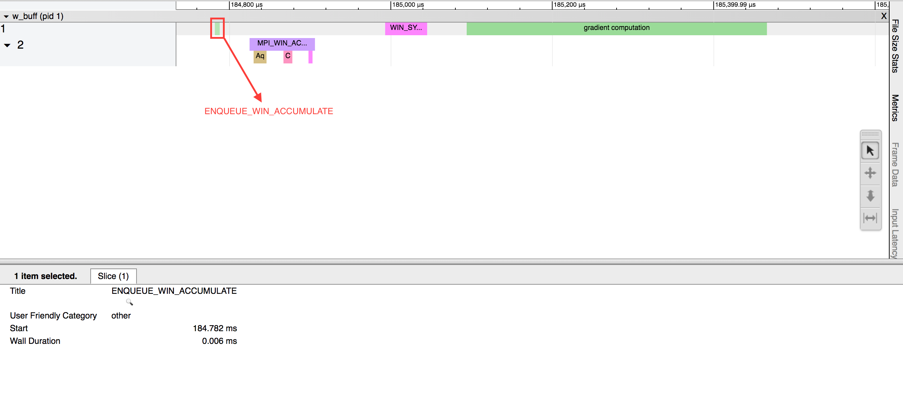

Bluefog Timeline
================

Bluefog timeline is used to record all activities occurred during your distributed training 
process. With Bluefog timeline, you can understand the performance of your training 
algorithm, indentify the bottleneck, and then improve it. 

The development of Bluefog timeline is based on the `Horovod timeline`_. Similar to Horovod, 
Bluefog timeline clearly visualizes the start and end of all communication stages between 
agents such as ``allreduce``, ``broadcast``, ``neighbor_allreduce``, ``win_put``, 
``win_accumulate`` and many others. Some of these communication primitives are exclusive 
to Bluefog. 

An enhanced feature of Bluefog timeline is to visualize the computation states of each 
agent such as ``forward propogation`` and ``backward propogation``. The visualization of both 
communication and computation will help a better understanding of your training algorithm. 
For example, Bluefog timeline will tell how your computation is in parallel with the 
communication.

Usage
-----
To record a Bluefog timeline, set ``--timeline-filename`` command line argument to the 
location of the timeline file to be created. This will generate a timeline record file
for each agent. For example, the following command ::

    $ bfrun -np 4 --timeline-filename /path/to/timeline_filename python example.py

will generate four timeline files: ``timeline_filename0.json``, ``timeline_filename1.json``, 
``timeline_filename2.json``, and ``timeline_filename3.json``, and each json file is for 
a different agent. You can then load the timeline file into the 
`chrome://tracing`_ facility of the Chrome browser. If the operation ``--timeline-filename``
is not set, the timeline function will be deactivated by default.

Example I: Logistic regression with neighbor_allreduce
------------------------------------------------------
In the first example, we show the timeline when running decentralized SGD for 
logistic regression, see the figure below. In this example, each rank is connected
via an undirected power-2 topology. We exploit the 
primitive ``neighbor_allreduce`` to perform the neighbor averaging.

.. image:: ./_static/bf_timeline_example1a.png
   :width: 800
   :align: center

There are two active threads in the timeline: thread 1 that is mainly for gradient 
**computation** and thread 2 for **communication**. There is a phase ``MPI_NEIGHBOR_ALLREDUCE``
in thread 2 when neighbor allreduce actually happens. It is further divided into multiple 
sub-phases:

   + ``ALLOCATE_OUTPUT``: indicates the time taken to allocate the temporary memory for neighbor's tensor.

   + ``COMMUNICATE`` indicates the time taken to perform the actual communication operation.

   + ``COMPUTE_AVERAGE`` indicates the time taken to compuate the average of variables received from neighbors. It is basically a reduce operation.

Another notable feature of this neighbor_allreduce timeline is that threads 1 and 2 are **synchronized**.
Each time when thread 1 enqueues a task for thread 2 to conduct communication, it will be blocked until
thread 2 finish communication. As a result, it is observed that the end of opeartion ``ENQUEUE_NEIGHBOR_ALLREDUCE``
in thread 1 aligns with the end of opeartion ``MPI_NEIGHBOR_ALLREDUCE`` in thread 2.

Example II: Logistic regression with win_accumulate
---------------------------------------------------
In this example, we still show the timeline when running decentralized SGD for 
logistic regression. Different from Example I, we employ the one-sided communication 
primitives ``win_accumulate`` to exchange information between neighboring ranks.

Different from Example I, it is observed that the computation thread (thread 1) and 
the communication thread (thread 2) were running independently. Thread 1 will not 
be blocked after enqueuing the ``WIN_ACCUMULATE`` task to thread 2 (``ENQUEUE_WIN_ACCUMULATE`` in
thread 1 and ``MPI_WIN_ACCUMULATE`` in thread 2 are not aligned). In other words,
the one-sided communication primitive enables nonblocking operation and will significantly
improve the training efficiency in real practice.

Example III: Resnet training with one-sided communication
---------------------------------------------------------
In this example, we show the timeline for a real experiment when decentralized SGD is used to 
train Resnet with CIFAR10 dataset. We exploit the one-sided communicaton primitive ``win_put'' 
to exchange information between ranks. It is observed that each phase during the training
is clearly illustrated in the timeline.

.. image:: ./_static/bf_timeline_example3.png
   :width: 800
   :align: center

.. _Horovod timeline:  https://github.com/horovod/horovod/blob/master/docs/timeline.rst
.. _chrome://tracing:  chrome://tracing/